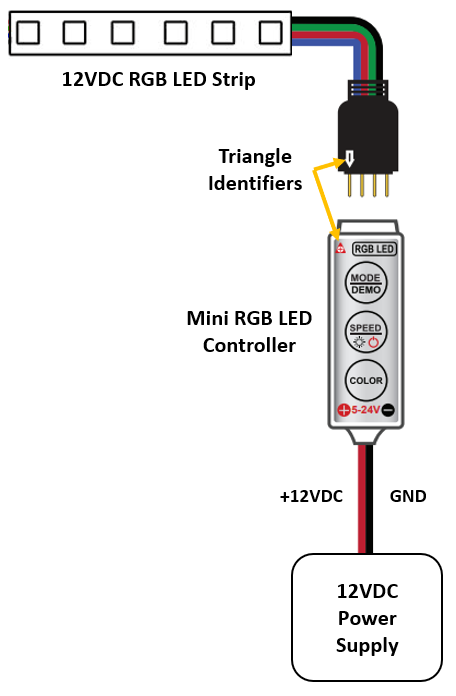
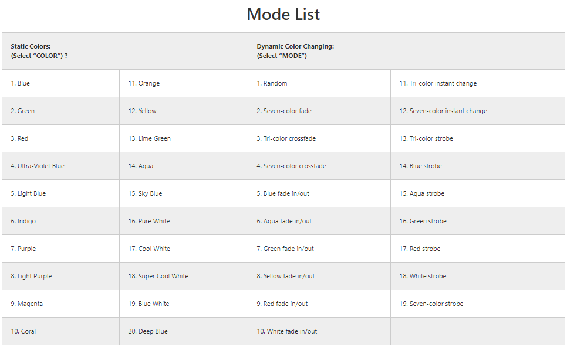

# Cube Enclosure Overview
The enclosure of the Cube artifact comprises two parts: the Cube body and back plate. The Cube body mounts to the back plate and houses the Bluetooth radio, LED controller, and RGB LED strips.

The 3D design files for these parts have been provided in this package:

* *Cube_Artifact_Body.STEP*
* *Cube_Artifact_Backplate.STEP*

The body is designed to be 3D-printed on a Formlabs resin-based stereolithography machine. Other printers and materials may be used to achieve a similar effect including ABS, PLA, or another transparent plastic material.

The back plate is designed to be cut out of a ¼” thick sheet of clear acrylic using a 40-watt CO2 laser. Other similar materials or manufacturing processes may also be used.

# Cube Assembly

## Supporting Files:
* *Cube_Artifact_BOM.xlsx*
* *Cube_Artifact_RGB_LED_Electrical_Schematic.PNG*

## Instructions:
**Cube Outer Enclosure:**

1. Verify that the four mounting holes in the bottom corners of the body are free of any support material and measure a diameter of at least 6.35 mm by 6.5 mm deep. The brass M4 threaded inserts should easily slide in and out of the holes.

2. Mix a small amount of clear epoxy and apply it to the outside face of the threaded insert being careful to avoid introducing any epoxy into the interior threads.
    
3. Insert the threaded insert into the 6.35 mm hole in the bottom corner of the Cube ensuring that the top face of the threaded insert is level with or slightly below the inside edge of the Cube.
    
4. Repeat steps 3 and 4 for each of the 3 additional threaded inserts that reside in each corner.

5. Once the epoxy is fully cured insert the acrylic backplate into the recessed pocket on the bottom face of the Cube ensuring that the 4 threaded inserts line up with the diagonal slots in each corner of the backplate. The top face of backplate should sit flush with the bottom edge of the body.

6. Using the 2.5 mm hex driver, insert one M4 x 12mm button head screw into each of the bottom four corners of the Cube *NOTE: The Cube Artifact will be mounted using the ¼”-OD hole located in the center of the back plate.

**Cube RGB LED Assembly**: 

1. Cut the RGB LED strip to the desired length *NOTE: The RGB LED strip has seams marked every 100 mm and should be cut along the marked lines to ensure functionality.

2. Solder the 4-pin, color-coded, pigtail connector included with the RGB LED Controller to the four corresponding solder pads on the LED strip marked “+12V”, “G”, “R”, “B”.

3. Plug the 4-pin pigtail connector into the RGB LED controller ensuring that the triangle identifiers on the pigtail and RGB LED Controller line up.

4. Connect the red and black leads exiting the other end of the RGB LED controller to +12VDC (red) and GND (black) on an appropriately sized power supply.

5. Press the “Mode/Demo” button to turn on the controller and activate Dynamic Mode, additional presses of the “Mode/Demo” button cycle through 19 Dynamic effects (See LED_Controller_Mode_List.PNG below). The specified dynamic color changing mode is noted as “2. Seven-color fade”. Note: this mode can be seen in [Cube_Video.mp4](Cube_Video.mp4).

